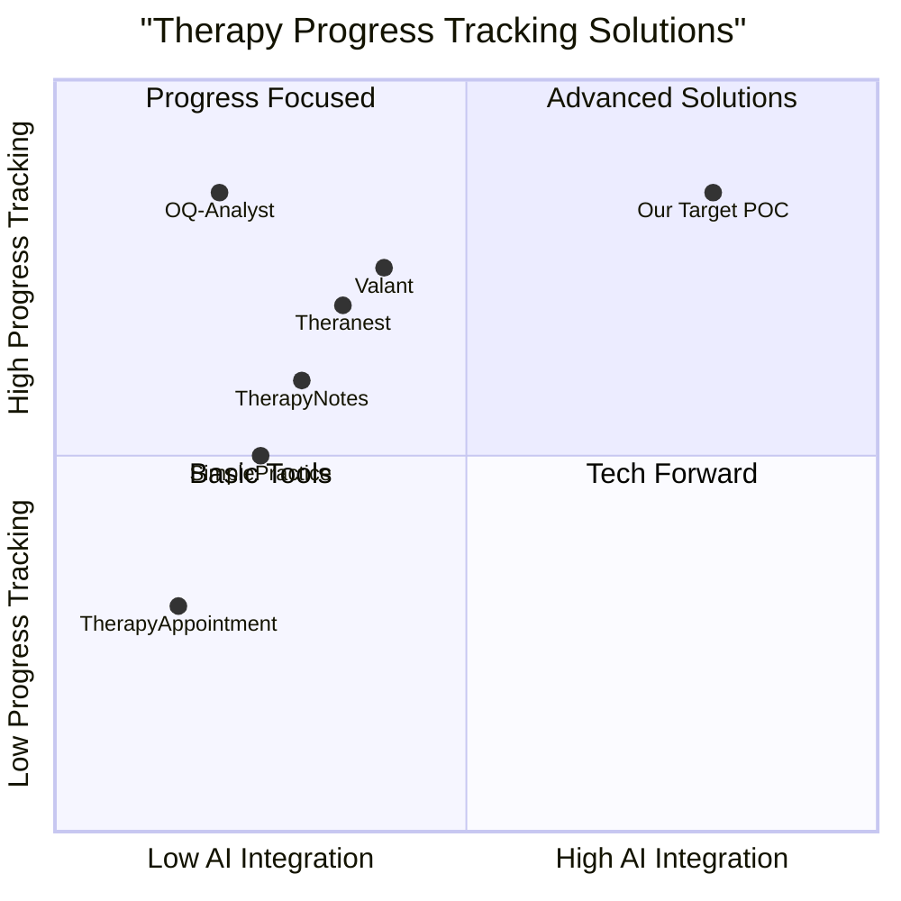

# Product Requirements Document (PRD)

## Therapy Progress Tracking POC

### Version 1.0 | June 2, 2025

## 1. Introduction

### 1.1 Project Description

Mentalyc is developing a Proof of Concept (POC) solution for tracking psychotherapy progress between sessions. The system will analyze structured therapy notes generated from session recordings to assess client progress, identify trends in symptoms, and map symptoms to standardized mental health assessments.

### 1.2 Original Requirements

Develop a POC for tracking therapy progress with:
1. A simple user interface for therapists to submit and compare multiple therapy sessions
2. An AI approach to track patient progress between sessions
3. Documentation of the approach and research process

### 1.3 Project Scope

This POC will focus on:
- Analyzing structured therapy notes in JSON format
- Extracting and tracking symptoms across sessions
- Mapping symptoms to standardized assessment frameworks (GAD-7, PHQ-9)
- Visualizing progress with comparative metrics
- Providing actionable insights to therapists

## 2. Product Definition

### 2.1 Product Goals

1. **Objective Tracking**: Enable therapists to quantitatively measure client progress across multiple therapy sessions based on symptom changes.

2. **Automated Assessment**: Map extracted symptoms to standardized assessment frameworks (GAD-7, PHQ-9) to generate comparable scores across sessions.

3. **Actionable Insights**: Provide therapists with clear visualizations and recommendations based on detected progress or regression in client symptoms.

### 2.2 User Stories

1. As a therapist, I want to upload multiple session notes for a client so that I can objectively track their progress over time.

2. As a therapist, I want to see a visual representation of my client's symptom changes so that I can quickly identify areas of improvement or concern.

3. As a therapist, I want the system to automatically map symptoms to standardized assessment frameworks so that I can compare client progress against established clinical measures.

4. As a therapist, I want to receive specific insights about my client's progress so that I can tailor future treatment strategies.

5. As a clinical supervisor, I want to review objective metrics of client progress so that I can evaluate treatment effectiveness.

### 2.3 Competitive Analysis

| Product | Pros | Cons |
|---------|------|------|
| **TherapyNotes** | Comprehensive EHR system; HIPAA compliant; Good note templates | Limited progress tracking capabilities; No AI analysis; No standardized assessment mapping |
| **SimplePractice** | User-friendly interface; Client portal; Good billing integration | Basic progress tracking; No automated symptom extraction; No comparative visualization |
| **Theranest** | Customizable notes; Treatment planning tools; Assessment library | Manual assessment scoring; Limited visualization tools; No automated progress tracking |
| **Valant** | Outcomes measurement tools; Treatment planning; Specialty-specific content | Complex interface; Expensive; No AI-driven insights |
| **OQ-Analyst** | Focused on outcome measurement; Evidence-based assessments; Progress alerts | Limited note-taking capabilities; No symptom extraction; Separate system from EHR |
| **TherapyAppointment** | Simple interface; Good scheduling tools; Client portal | Very basic notes; No progress tracking; No assessment integration |
| **Our POC Solution** | AI-driven symptom extraction; Automated assessment mapping; Visual progress tracking; Actionable insights | Initial POC with limited features; Not fully integrated into clinical workflow; Limited to text analysis of structured notes |

### 2.4 Competitive Quadrant Chart

## 3. Technical Specifications

### 3.1 Requirements Analysis

Based on the analysis of session notes and the project goals, the POC must accomplish the following:

1. **Data Processing Requirements**:
   - Parse structured JSON therapy notes
   - Extract symptom information and relevant metadata
   - Compare symptoms across multiple sessions
   - Map symptoms to standardized assessment frameworks

2. **UI Requirements**:
   - Simple interface for uploading session notes
   - Session comparison view
   - Progress visualization dashboard
   - Detailed symptom change analysis

3. **AI Requirements**:
   - NLP for symptom extraction and classification
   - Symptom severity assessment
   - Progress prediction model
   - Assessment framework mapping

4. **Output Requirements**:
   - Visual progress metrics
   - Comparative session analysis
   - Standardized assessment scores
   - Actionable insights for therapists

### 3.2 Requirements Pool

#### P0 (Must-have)

1. **File Upload**: System must allow therapists to upload multiple JSON session notes for a single client.

2. **Symptom Extraction**: System must automatically extract symptoms and their attributes (description, intensity, frequency, etc.) from the notes.

3. **Session Comparison**: System must analyze and compare symptoms between at least two sessions to assess progress.

4. **Basic Visualization**: System must provide visual representation of symptom changes between sessions.

5. **Progress Metrics**: System must generate at least one quantifiable metric of overall progress based on symptom changes.

#### P1 (Should-have)

6. **Standardized Assessment Mapping**: System should map extracted symptoms to GAD-7 and PHQ-9 frameworks and generate approximate scores.

7. **Detailed Symptom Analysis**: System should provide detailed analysis of each symptom's changes across sessions.

8. **Progress Insights**: System should generate specific insights about client progress and potential focus areas.

9. **Multiple Session Support**: System should handle analysis across more than two sessions to show trends over time.

10. **Data Export**: System should allow export of progress reports in PDF format.

#### P2 (Nice-to-have)

11. **Additional Assessment Frameworks**: System may support additional standardized assessment frameworks beyond GAD-7 and PHQ-9.

12. **Treatment Recommendations**: System may suggest potential treatment strategies based on progress patterns.

13. **Client View**: System may include a limited client-facing view showing progress in a positive, motivational format.

14. **Integration API**: System may provide an API for potential integration with existing EHR systems.

15. **Custom Assessment Creation**: System may allow therapists to create custom assessment frameworks.

### 3.3 UI Design Draft

#### 3.3.1 Dashboard Layout

The interface will consist of four primary screens:

1. **Upload Screen**:
   - File upload area (drag-and-drop + file selector)
   - Client identifier field
   - Session date fields
   - Submit button
   - Previous uploads list

2. **Progress Dashboard**:
   - Overall progress score (prominent)
   - Session comparison timeline
   - Key metrics summary
   - Standardized assessment scores (GAD-7, PHQ-9)
   - Navigation to detailed views

3. **Symptom Comparison View**:
   - Side-by-side comparison of symptoms across sessions
   - Severity/frequency change indicators
   - Change metrics for each symptom
   - Symptom categorization by domain (psychological, biological, social)

4. **Detailed Analysis View**:
   - Comprehensive progress analysis
   - Standardized assessment details
   - Specific insights and observations
   - Potential focus areas for future sessions
   - Export/share options

#### 3.3.2 UI Flow

1. Therapist uploads two or more session notes for a client
2. System processes the notes and extracts relevant information
3. System displays the Progress Dashboard with an overall progress score
4. Therapist can navigate to Symptom Comparison for detailed symptom changes
5. Therapist can access Detailed Analysis for comprehensive insights
6. Therapist can export or share the progress report as needed

### 3.4 AI Approach Specifications

#### 3.4.1 Data Processing Pipeline

1. **Input Processing**:
   - Parse JSON structured notes
   - Validate note structure against template
   - Extract client identifiers and session metadata

2. **Symptom Extraction**:
   - Identify all symptoms from the "Psychological Factors" > "Symptoms" section
   - Extract symptom attributes: description, onset, frequency, intensity, duration, quotes
   - Process additional relevant fields (sleep, mood, risk assessment, etc.)

3. **Symptom Comparison**:
   - Match symptoms across sessions based on descriptions and context
   - Analyze changes in frequency, intensity, and duration
   - Calculate change metrics for each symptom

4. **Assessment Mapping**:
   - Map extracted symptoms to GAD-7 and PHQ-9 question categories
   - Generate approximate scores based on symptom severity and frequency
   - Compare assessment scores across sessions

5. **Progress Analysis**:
   - Calculate overall progress score based on symptom changes
   - Identify areas of improvement and concern
   - Generate insights and potential focus areas

#### 3.4.2 AI Models and Techniques

1. **Symptom Extraction and Classification**:
   - Named Entity Recognition (NER) for symptom identification
   - Text classification for symptom categorization
   - Severity assessment based on descriptive language

2. **Progress Prediction Model**:
   - Regression model for progress score calculation
   - Feature importance analysis for identifying key progress factors
   - Confidence scoring for predictions

3. **Assessment Framework Mapping**:
   - Rule-based mapping for direct symptom-to-question correlation
   - Embedding-based similarity for indirect mapping
   - Score normalization based on standard assessment scoring rules

#### 3.4.3 Example Client Progress Analysis

Based on the provided session notes:

**Client 1 (Sessions 1 & 2)**:
- Initial symptoms included anxiety, stress, procrastination, feeling overwhelmed
- By session 2, significant improvement in anxiety (moderate → mild)
- Improved sleep, nutrition, and physical activity
- Resumed creative pursuits and set better boundaries
- Overall positive progress with GAD-7 score reduction

**Client 2 (Sessions 1 & 2)**:
- Initial symptoms included stress, anxiety, and time management issues
- By session 2, increased stress and anxiety (moderate → high)
- Developed sleep issues and feelings of hopelessness
- More isolation and academic difficulties
- Overall negative progress with increased GAD-7 score

### 3.5 Open Questions

1. **Data Privacy**: How should we handle client confidentiality and data security in the POC?

2. **Scale Calibration**: How can we ensure standardized assessment scores mapped from symptoms are clinically valid?

3. **Multiple Symptoms**: How should the system handle clients with multiple distinct symptoms that may progress at different rates?

4. **Therapist Verification**: Should the system allow therapists to override or adjust AI-generated assessments?

5. **Negative Progress**: How should the system present deterioration in client condition in a constructive way to both therapists and potentially clients?

6. **Integration Path**: What is the optimal path for integrating this POC with existing Mentalyc systems?

## 4. Technical Implementation

### 4.1 Tech Stack

- **Frontend**: React.js with Tailwind CSS
- **Backend**: FastAPI (Python)
- **AI Processing**: Python with spaCy, HuggingFace Transformers, scikit-learn
- **Visualization**: Chart.js or D3.js
- **Deployment**: Docker containers for easy deployment and testing

### 4.2 System Architecture

1. **Frontend Layer**:
   - React SPA for therapist interface
   - REST API communication with backend
   - Client-side data visualization

2. **Backend Layer**:
   - FastAPI server handling requests
   - Session note processing pipeline
   - Progress analysis engine
   - Assessment mapping service

3. **AI Processing Layer**:
   - NLP models for text analysis
   - Progress prediction model
   - Assessment mapping algorithms

4. **Data Storage Layer**:
   - Temporary storage for session processing
   - No permanent storage in POC phase (privacy focus)

### 4.3 Implementation Plan

1. **Phase 1: Core Processing**
   - Develop JSON parsing functionality
   - Implement basic symptom extraction
   - Create simple session comparison

2. **Phase 2: AI Development**
   - Build symptom classification model
   - Develop progress prediction algorithm
   - Implement assessment mapping

3. **Phase 3: UI Development**
   - Create upload interface
   - Build dashboard and visualization components
   - Implement detailed analysis views

4. **Phase 4: Integration & Testing**
   - Combine all components
   - Conduct testing with sample data
   - Refine based on feedback

## 5. Evaluation Criteria

### 5.1 Success Metrics

1. **Accuracy**:
   - Symptom extraction precision > 90%
   - Progress prediction correlation with therapist assessment > 0.7
   - Assessment mapping accuracy > 85% compared to manual scoring

2. **Performance**:
   - Processing time < 5 seconds per session
   - UI responsiveness < 200ms
   - Handling of sessions up to 50KB in size

3. **Usability**:
   - Therapist can successfully upload and analyze sessions with < 2 minutes training
   - UI clarity scores > 4/5 in user testing
   - Feature discoverability > 90%

### 5.2 Testing Approach

1. **Unit Testing**:
   - Automated tests for all AI processing components
   - UI component testing
   - API endpoint testing

2. **Integration Testing**:
   - End-to-end workflow testing
   - Cross-browser compatibility
   - Error handling verification

3. **User Testing**:
   - Therapist feedback sessions
   - Usability surveys
   - Feature validation with clinical experts

## 6. Documentation Requirements

### 6.1 Technical Documentation

1. **System Architecture**: Detailed explanation of components and their interactions

2. **AI Models**: Documentation of all models, training procedures, and evaluation metrics

3. **API Reference**: Complete API documentation for all endpoints

4. **Code Documentation**: Well-commented code with README files for each component

### 6.2 User Documentation

1. **User Guide**: Step-by-step instructions for all features

2. **Tutorial Videos**: Short demonstrations of key workflows

3. **FAQ**: Answers to common questions and troubleshooting

### 6.3 Research Documentation

1. **Approach Justification**: Explanation of chosen techniques and alternatives considered

2. **Literature Review**: Summary of relevant research in symptom tracking and progress assessment

3. **Validation Methods**: Description of how the system's accuracy was validated

4. **Limitations**: Clear documentation of system limitations and edge cases

## 7. Future Roadmap

### 7.1 Short-term Enhancements

1. Support for additional assessment frameworks
2. Improved symptom matching across diverse descriptions
3. Enhanced visualization options
4. Batch processing of multiple clients

### 7.2 Long-term Vision

1. Integration with full Mentalyc platform
2. Machine learning for personalized progress tracking
3. Predictive analytics for treatment outcomes
4. Client-facing progress tracking portal

## 8. Conclusion

This POC for therapy progress tracking represents an important step toward more data-driven and objective assessment of therapy outcomes. By leveraging AI to analyze structured therapy notes, we can provide therapists with valuable insights into client progress, helping them optimize treatment strategies and improve outcomes. The initial focus on symptom extraction, standardized assessment mapping, and progress visualization will establish a foundation for more advanced features in the future.